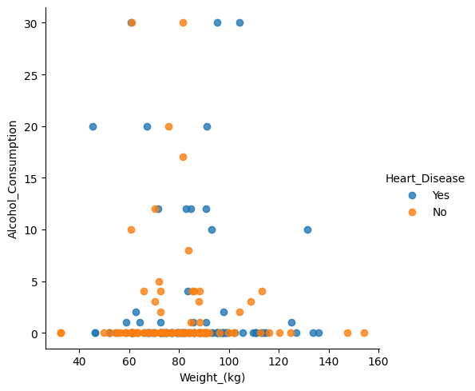
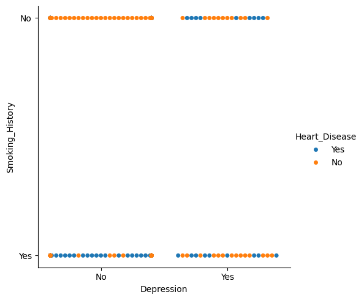
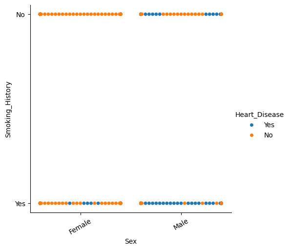

```{r setup, include=FALSE}
knitr::opts_chunk$set(echo = TRUE)
```

# Introduction 
Heart Disease is the second leading cause of death globally, responsible for approx 11% of total deaths. And these days you see a spike in heart attacks/ heart related diseases especially in younger generation those who are in between 18 to late 30's (these may be due to lot of factors, lifestyle patterns, dietary habits etc ) and they are equally prone to these diseases as an old age person, who's above 70 or 80. So it's very important to for us to analyze the lifestyle of a person, how we can use Exploratory Data Analysis to analyze the key factors that significantly impact the likelihood of developing heart related issues like heart disease.


**SMART QUESTION: ** Given a dataset containing information about lifestyle of a person, Can we use exploratory data analysis to identify key factors like age, height, weight, smoking_history etc that significantly impact the likelihood of developing Health related issues like Heart Disease.

And our main end goal here is to build a predictive model with the help of which we'll be able to accurately predict the likelihood of developing heart disease based on person's lifestyle.

We took the dataset from kaggel https://www.kaggle.com/datasets/alphiree/cardiovascular-diseases-risk-prediction-dataset/data which contains approximately 300,000 samples with 19 features, out of them 12 categorical and 7 numerical, where our target variable is going to be Heart Disease.

# Domain Knowledge
**Variable Introduction**

- **Age**: This is the age of the patient. Age is a crucial factor in disease prognosis as the risk of chronic conditions such as heart disease, cancer, diabetes, and arthritis increases with age. This is due to various factors including the cumulative effect of exposure to risk factors, increased wear and tear on the body, and changes in the body's physiological functions. 
    
- **Sex**: This feature represents the gender of the patient. Gender can influence disease prognosis due to biological differences and gender-specific lifestyle patterns. For instance, heart disease is more common in males, while skin cancer is more common in females. This could be due to factors like longer life expectancy or different exposure to risk factors in each gender. 
    
- **General_Health**: This is a self-rated health status of the patient. Patients who perceive their health as "Poor" or "Fair" are more likely to have chronic conditions. This could be because the symptoms or management of these conditions impact their perceived health status. 
    
- **Checkup**: This feature represents the frequency of health checkups. Regular health checkups can help in early detection and management of diseases, thereby improving the prognosis. 
    
- **Exercise**: This feature indicates whether the patient exercises regularly or not. Regular exercise can help control weight, reduce risk of heart diseases, and manage blood sugar and insulin levels, among other benefits. This aligns with the negative correlation observed between exercise and diseases such as heart disease, diabetes, and arthritis. 
    
- **Smoking_History**: This feature indicates whether the patient has a history of smoking. Smoking can increase disease risk as it can damage blood vessels, increase blood pressure, and reduce the amount of oxygen reaching the organs.

**These features collectively provide a comprehensive profile of the patient, incorporating demographic factors, health conditions, and lifestyle habits that are all known to influence disease prognosis. The model trained on these features thus has the potential to provide accurate disease predictions based on a wide range of factors.**


```{r library_import,include=FALSE}
library(dplyr)
library(ggplot2)
library(tidyr)
library(skimr)
```


```{R read csv}
df = read.csv('CVD.csv')
```

# Data Summary
Below is the summary of the dataframe using skim function of skimr library. And we can see that there are 0 missing values in the dataset, couple of unique values throughout all the features. Mean, Median, SD, 0th, 25th,50th,75th,100th percentile is given for all the 7 numerical variable along with a small display of histogram.
```{R}
skim(df)
```

We can see the structure of the dataset after converting some of the categorical variables to factors. As we can see from the structure below General checkup, Sex, Age Category, Smoking History, Heart Disease, Skin Cancer, Other Cancer, Arthritis, Depression, Diabetes, Exercises are all converted to factors with levels.
```{R factorizing data}

#  'Sex' to a factor
df$Sex <- factor(df$Sex)

df$General_Health <- factor(df$General_Health)

df$Checkup <- factor(df$Checkup)

#  'Age_Category' to a factor
df$Age_Category <- factor(df$Age_Category)

#  'Smoking_History' to a factor
df$Smoking_History <- factor(df$Smoking_History)

#  'Heart_Disease' to a factor
df$Heart_Disease <- factor(df$Heart_Disease)

#  'Skin_Cancer' to a factor
df$Skin_Cancer <- factor(df$Skin_Cancer)

#  'Other_Cancer' to a factor
df$Other_Cancer <- factor(df$Other_Cancer)

#  'Arthritis' to a factor
df$Arthritis <- factor(df$Arthritis)

#  'Depression' to a factor
df$Depression <- factor(df$Depression)

#  'Diabetes' to a factor
df$Diabetes <- factor(df$Diabetes)

#  'Diabetes' to a factor
df$Exercise <- factor(df$Exercise)

str(df)
```

# Checking for duplicate values and summarizing after removing them
After careful observation, we found 80 duplicate values in the dataset, which have been removed using unique function in R.
```{r structure of the data}
dfDuplicate <- sum(duplicated(df))
cat("There were ", dfDuplicate," Duplicate Values", "\n")

df <- unique(df)
```

# Distribution of numeric variables

```{R}
# Visualization of data distribution
numerical_features <- c('Height_.cm.', 'Weight_.kg.', 'BMI', 
                        'Alcohol_Consumption', 'Fruit_Consumption', 
                        'Green_Vegetables_Consumption', 'FriedPotato_Consumption')

# Loop through the numerical features and create histograms with density plots
for (feature in numerical_features) {
  # Create a ggplot object for each feature
  plot <- ggplot(df, aes_string(x = feature)) +
    geom_histogram(binwidth = 1, fill = "blue", color = "black") +  # Create a histogram
    geom_density(aes(y = after_stat(count))) +
    ggtitle(paste("Distribution of", feature)) +
    xlab(feature) + ylab("Count") +
    theme_minimal()  # Minimal theme
    
  # Display the plot
  print(plot)
}

```

Interpretation Of Results: Height\_.cm.: The height of the patients seems to be following normal distribution with majority of patients having heights around 160 to 180cm.

Weight\_.kg.: The weight of the patients also appears to be following normal distribution, with patients having weights approximately between 60kg to 100kg.

BMI : The distribution of Body Mass Index is somewhat right-skewed. A large number of patients have a BMI between 20 and 30, which falls within the normal to overweight range. However, there are also a significant number of patients with a BMI in the obese range (\>30).

Alcohol_Consumption : This feature is heavily right skewed. Most patients have very low alcohol consumption, but there are few patients with high alcohol consumption as well.

Fruit_Consumption : This feature also seems to be right skewed. A lot of patients consume fruits regularly, but a significant number consume them less regularly.

Green_Vegetables_Consumption : This feature appears to be following normal distribution with most patients consuming green vegetables regularly.

FriedPotato_Consumption : This feature seems to be right skewed. Many patients consume fried potatos less frequently, while few consume them more often.

```{R}
# Define the list of categorical features
categorical_features <- c('General_Health', 'Checkup', 'Exercise', 'Heart_Disease', 
                          'Skin_Cancer', 'Other_Cancer', 'Depression', 'Diabetes', 
                          'Arthritis', 'Sex', 'Age_Category', 'Smoking_History')

# Loop through the categorical features and create count plots
for (feature in categorical_features) {
  # Create a ggplot object for each feature
  plot <- ggplot(df, aes_string(x = feature)) +
    geom_bar() +  # Create a bar plot
    ggtitle(paste("Count of", feature)) +
    theme(axis.text.x = element_text(angle = 90, hjust = 1)) + # Rotate x-axis labels
    geom_text(stat='count', aes(label=scales::percent(..count../sum(..count..))), 
              vjust=1.6, color="black", size=3)
  # Display the plot
  print(plot)
}

```

# Interprettation of Results:

General_Health : Most patients describe their general health as "Very Good", with "Good" being the second most response. Few patients rate their health as "Fair" and "Poor"

Checkup : Majority of the patients did checkup with in the past year. Fewer patients had their last checkup 2 years ago or more than 5 years ago.

Exercise : Most patients do exercises regularly compared to those who do not.

Heart_Disease : A significant majority of patients do not have any heart disease, only a small proportion of patients have heart disease.

Skin_Cancer : Vast majority of patients do not have skin cancer.

Other_Cancer : Similar to skin cancer, vast majority of patients do not have any kind of cancer.

Depression : Most patients do not have any depression, however small proportion of patients do report having depression.

Diabetes: Most patients do not have diabetes, which is similar to the disease-related features mentioned above. However, diabetes affects a small percentage of the population.

Arthritis: While the majority of patients do not have arthritis, a significant number do.

Sex: The dataset contains slightly more female patients than male patients.

Age_Category: Patients from a wide range of ages are included in the dataset. The age group 50-54 has the most patients, followed by the 55-59 and 60-64 age groups.

Smoking_History: The vast majority of patients have never smoked.

# Heart Disease Vs Smoking history

```{R}

# Viz Heart Disease and Smoking History
ggplot(df, aes(x = Smoking_History, fill = Heart_Disease)) +
  geom_bar(position = "fill") +
  labs(title = "Smoking history vs. Heart_Disease")

```

# Age_Category vs. Heart_Disease

```{R}
ggplot(df, aes(x = Age_Category, fill = Heart_Disease)) +
  geom_bar(position = "fill") +
  labs(title = "Age_Category vs. Heart_Disease")

```

# Other_Cancer vs. Heart_Disease

```{R}
ggplot(df, aes(x = Other_Cancer, fill = Heart_Disease)) +
  geom_bar(position = "fill") +
  labs(title = "Other_Cancer vs. Heart_Disease")
```

# Sex vs. Heart_Disease

```{R}
ggplot(df, aes(x = Sex, fill = Heart_Disease)) +
  geom_bar(position = "fill") +
  labs(title = "Sex vs. Heart_Disease")
```

# Skin_Cancer vs. Heart_Disease

```{R}
ggplot(df, aes(x = Skin_Cancer, fill = Heart_Disease)) +
  geom_bar(position = "fill") +
  labs(title = "Skin_Cancer vs. Heart_Disease")
```

# Alcohol Consumption vs. Heart Disease

```{R}
ggplot(df, aes(x = (Heart_Disease), y = Alcohol_Consumption, fill = Heart_Disease)) +
  geom_boxplot() +
  labs(title = "Alcohol Consumption vs. Heart Disease") +
  ylab("Alcohol Consumption")
```

# BMI vs. Heart Disease

```{R}
ggplot(df, aes(x = Heart_Disease, y = BMI, fill = Heart_Disease)) +
  geom_boxplot() +
  labs(title = "BMI vs. Heart Disease") +
  ylab("BMI")
```

# Fried Potato Consumption vs. Heart Disease

```{R}
ggplot(df, aes(x = Heart_Disease, y = FriedPotato_Consumption, fill = Heart_Disease)) +
  geom_boxplot() +
  labs(title = "Fried Potato Consumption vs. Heart Disease") +
  ylab("Fried Potato Consumption")
```

# Fruit Consumption vs. Heart Disease

```{R}
ggplot(df, aes(x = factor(Heart_Disease), y = Fruit_Consumption, fill = Heart_Disease)) +
  geom_boxplot() +
  labs(title = "Fruit Consumption vs. Heart Disease") +
  ylab("Fruit Consumption")
```

# BMI - Heart Disease

```{r}
ggplot(df, aes(x = BMI, fill = Heart_Disease)) +
  geom_density(alpha = 0.5) +
  labs(title = "BMI Density by Heart_Disease", x = "BMI") +
  scale_fill_manual(values = c("No" = "blue", "Yes" = "red"))


ggplot(df, aes(x = Heart_Disease, y = BMI, fill = Heart_Disease)) +
  geom_violin() +
  labs(title = "BMI vs. Heart_Disease", x = "Heart_Disease", y = "BMI")

# Histograms of BMI by Heart_Disease
ggplot(df, aes(x = BMI, fill = Heart_Disease)) +
  geom_histogram() +
  labs(title = "Histograms of BMI by Heart_Disease", x = "BMI", y = "Frequency") +
  scale_fill_manual(values = c("No" = "blue", "Yes" = "red"))

```

```{R}
# Explore Relationships (e.g., Heart_Disease vs. Lifestyle Factors)
health_issues <- c("Heart_Disease", "Skin_Cancer", "Other_Cancer", "Arthritis")
Life_Styles <- c("Exercise", "Sex", "Age_Category", "Height_.cm.", "Weight_.kg.", "BMI", "Smoking_History", "Alcohol_Consumption", "Fruit_Consumption", "Green_Vegetables_Consumption", "FriedPotato_Consumption")

for (issue in health_issues) {
  for (style in Life_Styles){
    p <- ggplot(df, aes(x = .data[[issue]], fill = .data[[style]])) +
      geom_bar(position = "fill") +
      labs(title = paste(issue, "vs.", style))
    print(p)
  }
}
```

```{R}
# Box Plots for Height and Weight vs. Heart_Disease
boxplot_data <- df %>%
  select(Heart_Disease, Height_.cm., Weight_.kg.)

boxplot_data_long <- boxplot_data %>%
  pivot_longer(cols = -Heart_Disease, names_to = "Variable", values_to = "Value")

p <- ggplot(boxplot_data_long, aes(x = Heart_Disease, y = Value, fill = Heart_Disease)) +
  geom_boxplot() +
  facet_wrap(~Variable, scales = "free_y") +
  labs(title = "Height and Weight vs. Heart_Disease")

print(p)

```

# chi-squared test between Heart_Disease and Smoking_History

```{R}


# List of categorical variables to be check for relation with Heart_Disease
categorical_variables <- c("Skin_Cancer", "Other_Cancer", "Depression", "Diabetes", "Arthritis", "Sex", "Age_Category", "Exercise", "Smoking_History","Smoking_History")

# chi-squared test for each categorical variable
for (var in categorical_variables) {
  chi_square_result <- chisq.test(df$Heart_Disease, df[[var]])
  cat("\nChi-squared Test: ", var, "vs. Heart_Disease:\n")
  print(chi_square_result)
}


### My Notes: If p value < 0.5 it indicates that both variables are significantly related
### All values are less than 0 and shows that all are significantly related (Should check the code r is it completly fine)
```

# Hypothesis Testing:

**1.Objective: To test whether there is a significant difference in the mean "Fruit_Consumption" between individuals with and without heart disease.**

**Hypothesis:** **Null Hypothesis (H0): There is no significant difference in "Fruit_Consumption" between individuals with and without heart disease.**

**Alternative Hypothesis (H1): There is a significant difference in "Fruit_Consumption" between individuals with and without heart disease.**

```{R fruit}

t_test_result <- t.test(Fruit_Consumption ~ Heart_Disease, data = df)
print(t_test_result)
```

#Observations \* The t-test results show that there is a significant difference in "Fruit_Consumption" between people with and without heart disease. \* The extremely low p-value indicates that there is strong evidence to reject the null hypothesis (H0). \* The 95% confidence interval, which excludes zero, adds to the rejection of the null hypothesis. Individuals without heart disease consume more fruit than those with heart disease.

**2.Objective: To test whether there is a significant difference in the mean "Alcohol_Consumption" between individuals with and without heart disease.**

**Null Hypothesis (H0): There is no significant difference in "Alcohol_Consumption" between individuals with and without heart disease.**

**Alternative Hypothesis (Ha): There is a significant difference in "Alcohol_Consumption" between individuals with and without heart disease.**

```{R alcohol}
t_test_result2 <- t.test(Alcohol_Consumption ~ Heart_Disease, data = df)
print(t_test_result2)
```

**Conclusion:** \* The t-Test results show a significant difference in "Alcohol_Consumption" between people with and without heart disease. \* The extremely low p-value indicates that there is strong evidence to reject the null hypothesis (H0). \* The 95% confidence interval, which excludes zero, adds to the rejection of the null hypothesis. Individuals without heart disease consume more alcohol on average than those with heart disease.

**3.Objective: To test whether there is a significant difference in the mean "Green_Vegetables_Consumption" between individuals with and without heart disease.**

**Null Hypothesis (H0): There is no significant difference in "Green_Vegetables_Consumption" between individuals with and without heart disease.**

**Alternative Hypothesis (Ha): There is a significant difference in "Green_Vegetables_Consumption" between individuals with and without heart disease.**

```{R vegetable}
t_test_result3 <- t.test(Green_Vegetables_Consumption ~ Heart_Disease, data = df)
print(t_test_result3)
```

**Conclusion:**

-   The results of the t-Test indicate a significant difference in "Green_Vegetables_Consumption" between individuals with and without heart disease.
-   The extremely small p-value suggests strong evidence to reject the null hypothesis (H0). The 95% confidence interval, which does not include 0, further supports the rejection of the null hypothesis.
-   On average, individuals without heart disease consume more green vegetables compared to those with heart disease.

**4.Objective: To test whether there is a significant difference in the mean "FriedPotato_Consumption" between individuals with and without heart disease.**

**Null Hypothesis (H0): There is no significant difference in "FriedPotato_Consumption" between individuals with and without heart disease.**

**Alternative Hypothesis (Ha): There is a significant difference in "FriedPotato_Consumption" between individuals with and without heart disease.**

```{R FriedPotato_Consumption}
t_test_result5 <- t.test(FriedPotato_Consumption ~ Heart_Disease, data = df)
print(t_test_result5)
```

**Conclusion:** \* The results t-Test indicate a significant difference in "FriedPotato_Consumption" between individuals with and without heart disease. \* The small p-value (2e-07) suggests strong evidence to reject the null hypothesis (H0). \* The 95% confidence interval, which does not include 0, further supports the rejection of the null hypothesis. \* On average, individuals without heart disease consume slightly more fried potatoes compared to those with heart disease.

# Multivariate Analysis

```{R}
df_yes <- subset(df, Heart_Disease == "Yes")
df_no <- subset(df, Heart_Disease == "No")

top_1000_df_yes <- head(df_yes, 1000)
top_1000_df_no <- head(df_no, 1000)
merged_df <- rbind(top_1000_df_yes, top_1000_df_no)

```

```{R}
ggplot(merged_df, aes(x = Weight_.kg., y = BMI, color = Heart_Disease)) +
  geom_point() +
  labs(title = "scatterplot of weight vs bmi colored by heart disease",
       x = "weight",
       y = "bmi") +
  theme_minimal()
```

## Observations.

**1. Most of the people without heart disease are lying towards the lower end of the plot, which also states that people with heavy weights and heavy body mass index seems to get affected more by heart disease.**

# Scatter plot for weight vs alcohol consumption coloured by Heart Disease

 \## Observations

**1. Can't find significant patterns but People with alocohol consumption 0 shows no signs of heart disease**

**2. Majority of people suffering with heart disease falls under alcohol consumption level of 15-30 and also people with heavy weights.**

# Scatter plot for depression and Smoking history vs Heart Disease.



## Observations.

**1. Person with No Smoking history and No Depression shows no signs of Heart Disease**

**2. Among Smoking History and Depression, Smoking History seems to have more impact on a Person's heart, because as seen in the plot, People with Smoking history and without depression are having heart diseases more than people without smoking history and with depression**

# Scatter plot for sex and Smoking history vs Heart Disease.



## Observations.

**1. Most of the people with heart disease are falling under person identified as Male with Smoking History**

**2. Hardly fewer or no observations for person identified as Female without Smoking History, but there are a few data points falling under a Male without smoking history.**

```{R}
# 3D Plot

library(plotly)
library(corrplot)

ds <- read.csv("CVD.csv")
convert_age_category <- function(category) {
  if (grepl("-", category)) {
    range <- as.numeric(strsplit(category, "-")[[1]])
    avg <- mean(range)
  } else {
    avg <- as.numeric(gsub("[^0-9]", "", category))
  }
  return(avg)
}

ds$Age_Category <- sapply(ds$Age_Category, convert_age_category)

plot_3d <- plot_ly(ds, x = ~BMI, y = ~Age_Category, z = ~Heart_Disease, 
                   type = "scatter3d", mode = "markers",
                   marker = list(size = 5, color = 'green', opacity = 0.7))

plot_3d <- plot_3d %>% layout(scene = list(
  xaxis = list(title = 'BMI', backgroundcolor = "rgb(200, 200, 230)"),
  yaxis = list(title = 'Age_Category', backgroundcolor = "rgb(230, 200, 230)"),
  zaxis = list(title = 'Heart_Disease', backgroundcolor = "rgb(200, 230, 200)")
),
margin = list(l = 0, r = 0, b = 0, t = 0))

plot_3d


```

```{R}

variables_to_analyze <- c("Height_.cm.", "Weight_.kg.", "BMI", "Fruit_Consumption", "Green_Vegetables_Consumption", "FriedPotato_Consumption", "Alcohol_Consumption")


anova_results <- list()

for (var in variables_to_analyze) {
  anova_result <- aov(reformulate("Heart_Disease", response = var), data = df)
  
  anova_results[[var]] <- anova_result
}

# Print 
for (var in variables_to_analyze) {
  cat("ANOVA Test for", var, "\n")
  print(summary(anova_results[[var]]))
}


```
